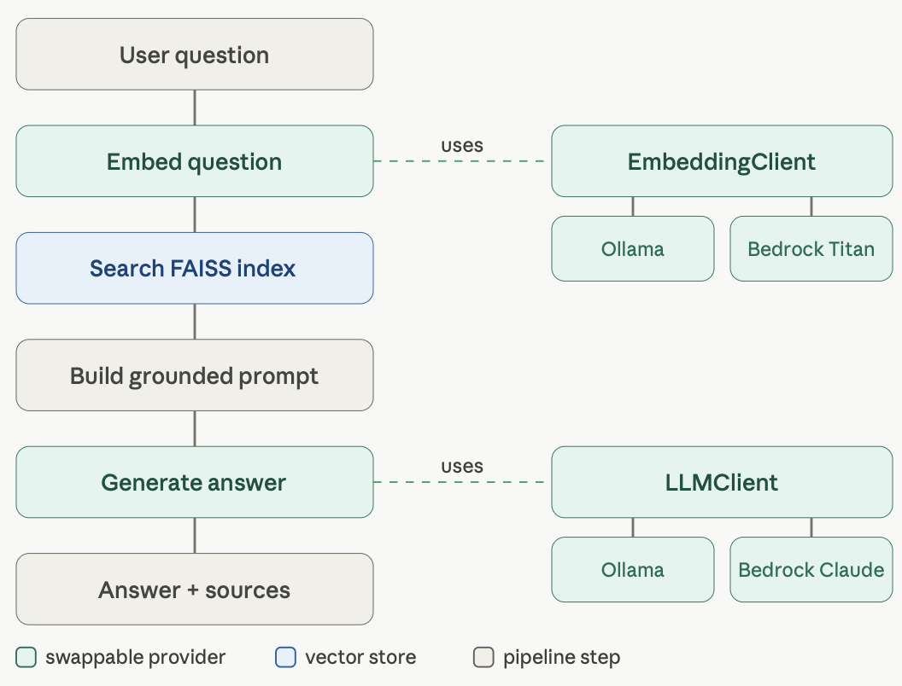
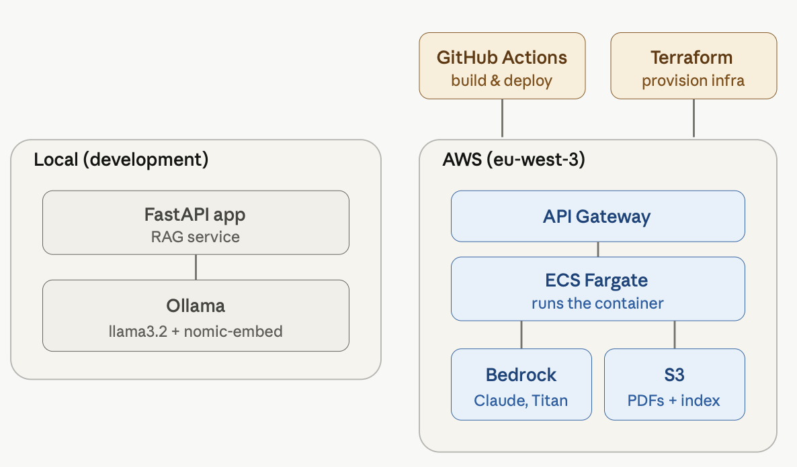
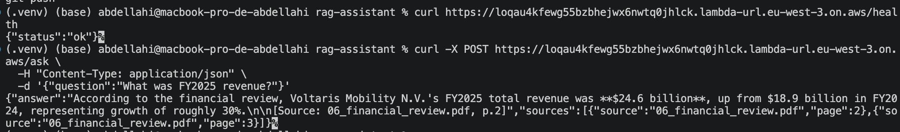
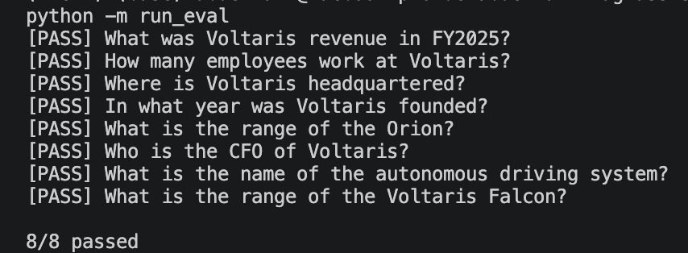

# RAG Assistant

An LLMOps project: a document Q&A system taken from local prototype to a fully
deployed, auto-shipping AWS service. Retrieval-augmented generation over Amazon
Bedrock, served by a containerized FastAPI app on AWS Lambda, with all
infrastructure as code in Terraform and a CI/CD pipeline that tests every PR and
deploys every merge.


Not a notebook demo: this is the full LLMOPS path from prototype to production, with
the deployment and automation as the point.
---

## What it does

Ask natural-language questions about a set of PDF documents and get answers
grounded in their content, with source citations. If the answer isn't in the
documents, it says so instead of guessing.

```
you > What was Voltaris revenue in FY2025?
bot > Voltaris reported FY2025 revenue of $24.6 billion.
      sources: 06_financial_review.pdf p.2
```

---

## Design

The project is built around a single idea: everything that differs between
"local" and "cloud" sits behind a small interface with two implementations,
chosen at runtime by an environment variable.

| Seam          | Interface         | Local (Ollama)        | Cloud (Bedrock)        |
|---------------|-------------------|-----------------------|------------------------|
| Generation    | `LLMClient`       | `llama3.2`            | Claude Haiku           |
| Embeddings    | `EmbeddingClient` | `nomic-embed-text`    | Titan Text Embeddings  |
| Vector store  | `VectorStore`     | FAISS (local file)    | FAISS                  |

Switching environments is a config change, not a rewrite.



---

## Project layout

```
src/config.py          settings, read from env (the local/cloud switch)
providers/llm.py       LLMClient + Ollama + Bedrock
providers/embeddings.py EmbeddingClient + Ollama + Bedrock
vectorstore.py         VectorStore + FAISS implementation
ingest.py              PDFs to chunks to embeddings to index
rag.py                 retrieve, build grounded prompt, answer
chat.py                terminal chat loop
api.py                 FastAPI service (/ask, /health)
run_eval.py            evaluation harness
Dockerfile             container image (runs locally and on Lambda)
terraform/             AWS infrastructure as code
data/pdfs/             source documents
```

---

## Quickstart (local)

```bash
# 1. install ollama (ollama.com) and pull models
ollama pull llama3.2
ollama pull nomic-embed-text

# 2. set up python
python -m venv .venv && source .venv/bin/activate
pip install -r requirements.txt
cp .env.example .env

# 3. add PDFs to data/pdfs/, then build the index and chat
python -m ingest
python -m chat
```

## Running on AWS Bedrock

Run the API locally instead of the terminal chat:

```bash
uvicorn api:app --reload
# then POST to http://127.0.0.1:8000/ask, or open /docs
```

## Running on AWS Bedrock

Set the providers to `bedrock` in `.env`, then re-ingest (the embedding model
changes, so the index must be rebuilt):

```bash
# .env: LLM_PROVIDER=bedrock, EMBEDDING_PROVIDER=bedrock
python -m ingest
python -m chat
```

## Deploying to AWS (Lambda + Terraform)

The app is containerized and deployed to AWS Lambda behind a public Function
URL, with all infrastructure defined in `terraform/`.

```bash
# build for lambda's architecture and push to ECR
docker build --platform linux/amd64 -t rag-assistant .
# (ecr login + tag + push)

# provision ECR, Lambda, IAM, and the function URL
cd terraform
terraform init
terraform apply
``` 


---

## CI/CD

Two GitHub Actions workflows automate testing and deployment:

- **CI** (`.github/workflows/ci.yml`) runs on every pull request: builds the
  index and runs the eval. A failing eval exits non-zero and blocks the merge,
  acting as a quality gate.
- **CD** (`.github/workflows/cd.yml`) runs on merge to `main`: builds the
  index, builds and pushes the image to ECR, and updates the Lambda.

So a push to a branch is tested via PR, and merging to `main` deploys
automatically. App/code changes deploy through CD; infrastructure changes are
applied manually via `terraform apply`.



---

## Evaluation

A test script runs a fixed set of questions and checks each answer:

```bash
python -m run_eval
```



---

## Notes & learnings


- Similarity thresholds are embedding-model-specific and must be retuned when the embedder changes.
- correctness vs quality (8/8 both, but answer quality differed) --> A substring-based eval shows both models are
  equally *correct* (8/8) on factual lookups, but does not capture answer *quality*: the local 3B model often buried or hedged correct answers, while Claude Haiku stated them cleanly.
- The same Docker image runs locally and on Lambda via the AWS Lambda Web
  Adapter, with no Lambda-specific code.
- The FAISS index is gitignored, so the CI/CD pipeline
  rebuilds it from the committed PDFs before building the image.


# Next improvements

- Move the index to Amazon S3 / OpenSearch Serverless so the container doesn't
  bake it in.
- Tighten the Bedrock IAM policy from `*` to the specific model ARNs (least
  privilege).
- Switch CI/CD AWS auth from access keys to OIDC (penID Connect). This a way for GitHub Actions to authenticate to AWS without storing keys as secrets as it is currently done.


